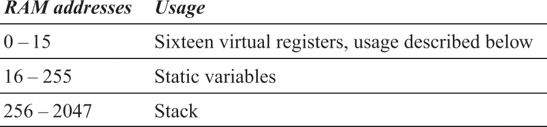
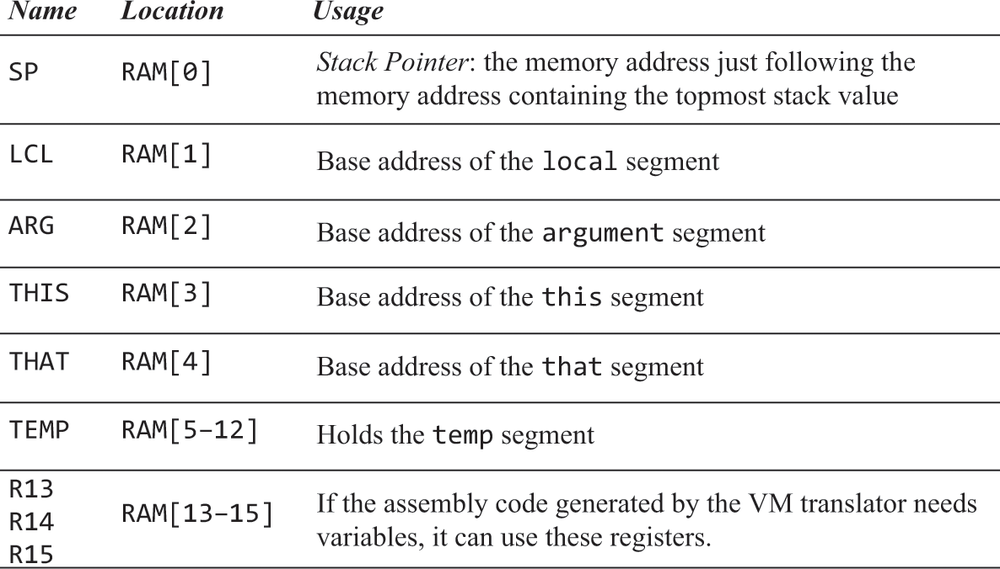
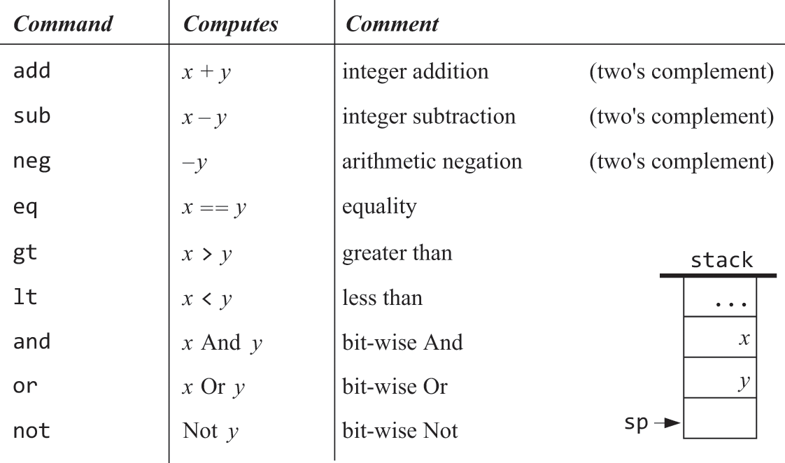

# Hack Machine VM Translator
Tradutor de código interino produzido pelo Jack Compiler para [Hack Machine Assembly](https://github.com/RenanGalvao/hack-machine-assembler). 
Feito para o projeto #7 do curso [Nand2Tetris](https://www.nand2tetris.org/) em C.

## Tabela de Conteúdo
- [Hack Machine VM](#hack-machine-vm)
    - [Mapeamento da RAM](#mapeamento-da-ram)
    - [Comandos](#comandos)
        - [Push/Pop](#push-%2F-pop)
        - [Lógico-Aritiméticos](#lógico-aritiméticos)
- [Uso](#uso)
- [Cobertura de testes](#cobertura-de-testes)
- [Autores](#autores)
- [Licença](#licença)
- [Notas](#notas)

## Hack Machine VM
Uma [stack machine](https://en.wikipedia.org/wiki/Stack_machine), feita para o Hack Computer, com 
apenas um tipo de dado: inteiro de 16 bits com sinal[^1]. Um programa nessa VM, é uma sequência de 
comandos separados por linhas num arquivo ``Program.vm``, cada comando pode estar numa categoria:

- push/pop
- lógico-aritiméticos
- controle de fluxo
- funcões

### Mapeamento da RAM
Os segmentos ``local``, ``argument``, ``this`` e ``that`` são mapeados dinâmicamente no Hack Computer.
O segmento ``pointer`` possui duas possibilidades: 0 e 1, que são mapeadas respectivamente para ``this``
 e ``that`` ou ``RAM[3]`` e ``RAM[4]``, que são a implementação concreta no Hack Computer. O segmento 
``temp`` também é fixo e mapeado nos endereços ``RAM[5]`` a ``RAM[12]``. O segmento ``constant`` é um
segmento virtual e portanto não é mapeado para nenhum espaço físico na memória. O segmento ``static``
é mapeado nos endereços ``RAM[16]`` a ``RAM[255]``.

    
ver imagens

*base address*
: é o endereço concreto no Hack Computer.

### Comandos

#### Push / Pop
push *segment index*
: move o valor de ``segment[index]`` para a *stack*, onde *segment* pode ser ``argument``, ``local``, 
``static``, ``constant``, ``this``, ``that``, ``pointer`` ou ``temp`` e *index* é um número não negativo. 

 

pop *segment index*
: faz o caminho inverso de *push*: retira da *stack* e move para ``segment[index]``, onde *segment* pode
ser os mesmos que no caso de push, com exceção de ``constant`` que é um segmento virtual.

#### Lógico-Aritiméticos
- aritiméticos: ``add``, ``sub``, ``neg``
- comparação: ``eq``, ``gt``, ``lt``
- lógicos: ``and``, ``or``, ``not``

    
ver imagem

## Uso
- Tenha o [Ceedling](https://www.throwtheswitch.org/ceedling#get-ceedling-section) instalado.
- Obtenha uma cópia do repositório ``git clone https://github.com/RenanGalvao/hack-machine-vm-translator``.
- Entre na pasta e execute o build ``cd hack-machine-vm-translator && ceedling release``.

Para gerar o código ``asm``, utilize dentro da pasta raiz: ``./build/release/vm-translator <source-file>``. 
Caso não tenha nenhum tipo de erro no código fonte, o arquivo ``.asm`` estará na mesma pasta que o código fonte.

## Cobertura de Testes

## Autores
- [@RenanGalvao](https://www.github.com/RenanGalvao)

## Licença
[GPL-3.0](LICENSE)

[^1]: Os valores de *true* e *false* são representados respectivamente por -1 e 0.
